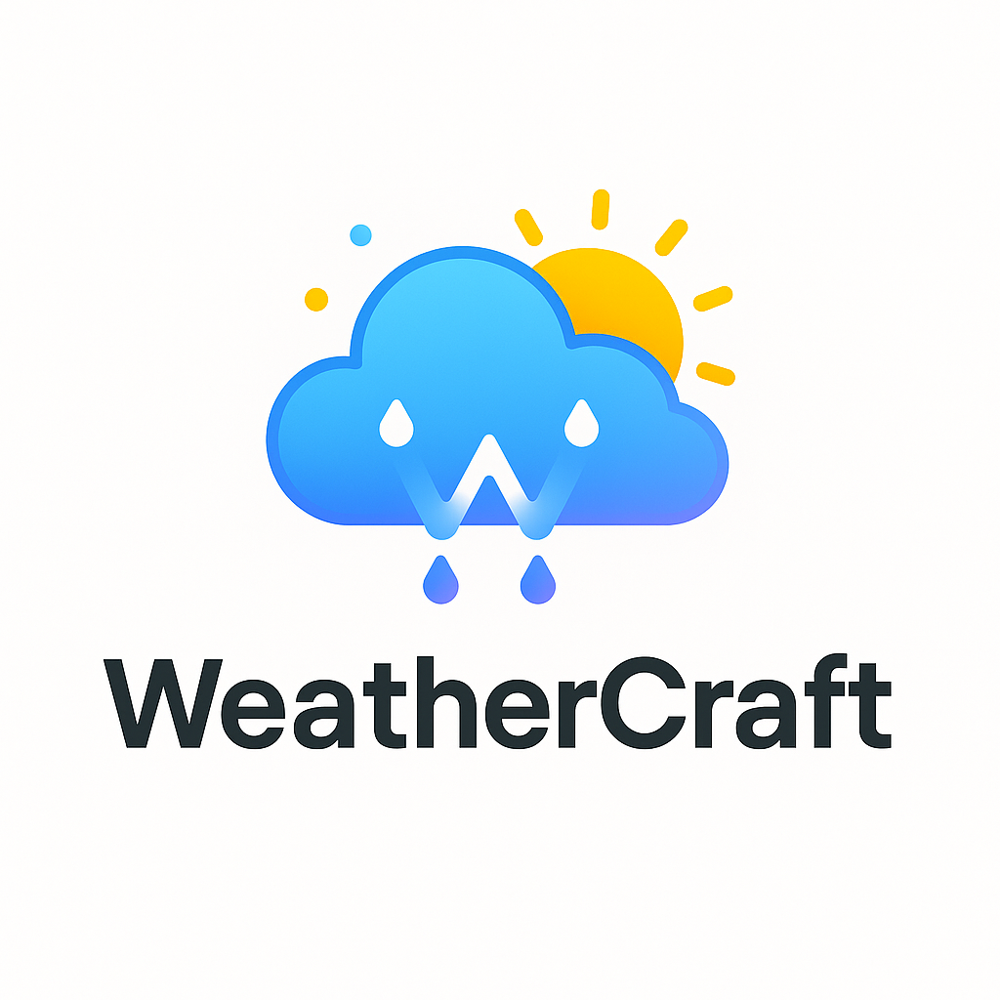

# 🌦️ WeatherCraft: Real-Time Weather Dashboard 

*A stunning, interactive weather application built with passion during our hackathon*  


## 🌟 Live Demo
Experience WeatherCraft right now:  
🔗 **[weather-site-green.vercel.app](weather-site-green.vercel.app)**


## ✨ Features That Spark Joy

- 🌍 **Location Intelligence** - Get precise weather for any city worldwide
- 🌡️ **Smart Unit Conversion** - Seamless Celsius/Fahrenheit toggle
- 🎨 **Dynamic Visuals** - Backgrounds & icons that adapt to weather conditions
- ⏰ **Local Time Magic** - Accurate timezone conversion
- 🎉 **Celebration Mode** - Confetti explosions for perfect weather days
- 📱 **Responsive Design** - Beautiful on any device

**Clone the repo**
   ```bash
   git clone [https://github.com/shifa-23/WeatherSite]

## 🛠️ Tech Stack
| Category       | Technology Used           |
|----------------|--------------------------|
| **Frontend**   | HTML5, CSS3, JavaScript  |
| **Animations** | GSAP, CSS Animations     |
| **Icons**      | Font Awesome             |
| **API**        | OpenWeatherMap API       |


"There's no such thing as bad weather, only different kinds of good weather."
